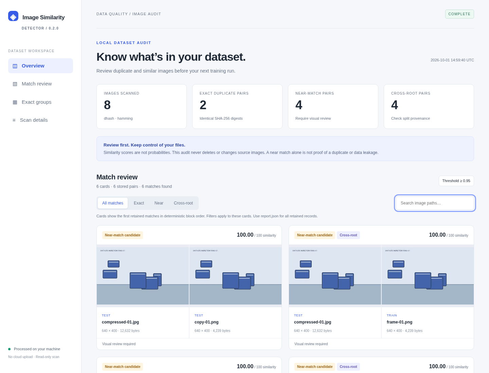

# Image Similarity Detector

**Inspect image datasets before training. Find duplicate files, review similar images, and check matches across dataset splits — locally.**

[](https://github.com/livejiaquan/image-similarity-detector/actions/workflows/ci.yml)
[](https://www.python.org/)
[](LICENSE)

[繁體中文](README-zh-TW.md) · [CLI reference](docs/USAGE.md) · [Architecture](docs/ARCHITECTURE.md) · [Report format](docs/REPORT_SCHEMA.md)



## Why this tool

Repeated exports, recompressed frames, and related images spread across train and test folders can complicate dataset evaluation. This tool produces a reviewable audit: exact duplicates, visual similarity candidates, cross-root matches, and input issues.

The project started as an internal image-analysis script. Version 0.2 turns that workflow into a tested Python package and CLI, with block-based comparison and an offline HTML report. It is a **beta dataset auditing tool**; detection quality depends on your images, backend, and threshold.

## Features

- SHA-256 duplicate detection, separated from visual similarity.
- Lightweight 256-bit difference hash by default; optional ImageNet ResNet50 features.
- Named input roots for train / validation / test comparison.
- Block comparison without allocating the full N × N similarity matrix.
- Batched neural inference on CPU, CUDA, or Apple MPS.
- Opt-in feature cache keyed by file content and encoder configuration.
- Self-contained HTML with previews, match filters, and path search.
- Versioned JSON with coverage, provenance, complete counts, and skipped-file reasons.
- Read-only source handling: no deletion, movement, or automatic cleanup.

## Install

Python 3.10+. Linux, Windows, and macOS are CI targets.

```bash
git clone https://github.com/livejiaquan/image-similarity-detector.git
cd image-similarity-detector
python -m venv .venv
source .venv/bin/activate
# Windows PowerShell: .venv\Scripts\Activate.ps1
python -m pip install .
```

The default backend needs only NumPy and Pillow. Once installed, scanning and viewing reports need no network or API key.

## First scan

```bash
image-similarity scan --input images=./dataset/images --output ./results
```

Each scan creates a unique directory with `report.html` and `report.json`. Open the HTML directly in your browser; no server is required.

To check dataset splits:

```bash
image-similarity scan \
  --input train=./dataset/train \
  --input test=./dataset/test \
  --scope cross-root \
  --cache-dir ./.image-similarity-cache \
  --output ./results
```

Input labels must be unique and roots must not overlap. Output and cache locations must be outside input roots.

## Reproducible demo

The demo uses synthetic illustrations, exact copies, and JPEG variants. It contains no company images.

```bash
python examples/make_demo.py --output demo-data
image-similarity scan --input train=demo-data/train --input test=demo-data/test
```

Default settings produce 8 scanned images, 2 exact pairs, and 4 near-match pairs. These counts demonstrate the workflow, not accuracy on real datasets. Download the included [sample report](docs/demo/report.html) and open it locally.

## Optional ResNet50

```bash
python -m pip install ".[neural]"
image-similarity scan --input images=./dataset/images \
  --backend resnet50 --threshold 0.99 --batch-size 32 --device auto
```

First use downloads torchvision's ImageNet `IMAGENET1K_V2` weights; later runs use the local model cache. For CUDA-specific wheels, follow the [official PyTorch installation instructions](https://pytorch.org/get-started/locally/).

| Backend | Score | Starting use | Main limitation |
| --- | --- | --- | --- |
| `dhash` | 1 − differing bits / 256 | Copies and mild recompression | Color, small details, crops, and low-information images can collide or be missed |
| `resnet50` | Cosine similarity, 2048 dimensions | Broader visual similarity | Distinct images of the same subject can score highly |

Scores from the two backends are not interchangeable or confidence probabilities. Calibrate with representative positive and negative pairs.

## Interpreting results

**Exact** means equal SHA-256 digests. **Near** means different bytes with visual similarity above the threshold. **Cross-root** means images came from distinct named inputs.

Similarity is not transitive: A resembling B and B resembling C does not make A and C interchangeable. Only byte-identical files are grouped; the report gives no “safe to delete” count. Cross-root candidates warrant provenance checks and do not by themselves prove data leakage.

All eligible pairs are compared. JSON retains at most 10,000 matches by default; HTML shows at most 100 retained pairs. Complete totals, truncation, partial scans, and limits are explicit. Retention follows deterministic block order, not a top-score ranking.

## Engineering

```text
src/image_similarity_detector/
  models.py       Typed configuration and result schema
  discovery.py    Stable traversal and streaming SHA-256
  features.py     dHash and batched ResNet50 encoders
  cache.py        Content-addressed feature cache
  matching.py     Block comparison and exact-only grouping
  pipeline.py     Scan orchestration and issue accounting
  reporting.py    Portable HTML and JSON
  cli.py          Options, validation, and exit codes
  assets/         Report template, styles, and interaction
tests/            Matching, pipeline, cache, CLI, and report regressions
examples/         Synthetic demo generator
docs/             Usage, architecture, schema, and verification
```

```bash
python -m pip install -e ".[dev]"
ruff check src tests examples
ruff format --check src tests examples
python -m pytest
python -m build
```

CI covers core tests on Linux, Windows, and macOS, optional neural architecture, and built-wheel smoke tests. See [verification](docs/VERIFICATION.md) for executed checks and limits.

## Limits and privacy

Work remains **O(N²)**. Feature storage grows with image count; blocks bound similarity working memory, not total dataset size. No approximate index or million-image scalability is claimed.

JPEG, PNG, BMP, GIF, WebP, and TIFF are supported. EXIF orientation is normalized; animations/multipage files use the first frame. Corrupt inputs and symlinks are skipped and reported. Any input root with no readable images makes the scan partial, including empty folders and folders containing only unsupported files. `--strict` makes these input issues a failed dataset gate; without it, inspect the report status before interpreting zero matches.

Reports contain previews and names; JSON also contains absolute source paths. Share reports and caches deliberately. The public demo uses synthetic data only.

[Contributing](CONTRIBUTING.md) · [Changelog](CHANGELOG.md) · [MIT license](LICENSE)

