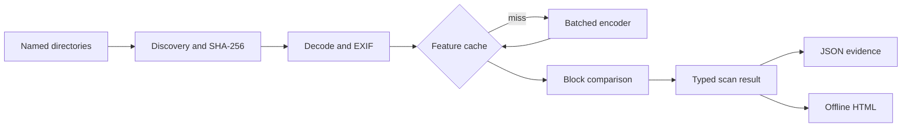

# Architecture

## Data flow

| Module | Responsibility |
| --- | --- |
| models | Immutable settings, records, and result envelope |
| discovery | Stable traversal, extension filtering, no symlink following, digest |
| features | EXIF normalization, dHash, optional torch/torchvision imports |
| cache | Encoder namespaces, validated arrays, atomic feature replacement |
| matching | Upper triangle, scope selection, complete counts, capped retention |
| pipeline | Batch lifetime, cache handling, input issues, exact groups |
| reporting | Escaping, portable thumbnails, CSP, JSON, unique run directories |
| cli | Parsing, destination validation, readable errors, exit codes |

Report assets are package resources so wheel installs work without a checkout.

## Identity and similarity

Equal SHA-256 digests establish exact candidates independently of floating-point cosine rounding. Different digests with qualifying visual scores are near candidates. Only digest-identical files are grouped; similarity is not transitive.

In cross-root mode, exact groups contain at least two distinct root labels and may contain multiple copies in either root. Candidates require task-specific provenance review.

## Memory and compute

With N images, D dimensions, block width B, and retained cap R:

- Work remains O(N²D).
- Features and associated arrays use O(ND), with constant-factor copies.
- Similarity working memory is O(B²), including masks.
- Retained pairs use O(R); metadata and exact groups use O(N).
- Decode memory depends on batch size and original image dimensions.
- HTML thumbnails are bounded by the card limit.

A 100,000 × 100,000 float32 matrix alone needs about 40 GB (decimal). Blocks avoid that allocation. One 100,000 × 2048 float32 feature matrix still needs about 819 MB before copies and model/decode memory. This is a memory improvement, not unlimited scalability.

Once retention fills, vectorized totals continue through all blocks. The retained subset follows deterministic block order; changing block size may change that subset.

## Reproducibility

Roots and relative paths are sorted. Sampling is absent. Neural inference uses evaluation mode. Dependency/device differences can change scores near a threshold.

Cache namespaces include encoder identity; ResNet also includes dependency versions, resolved device, and preprocessing/weights identity. Keys use content hashes. Arrays prohibit pickle and validate dtype, shape, finiteness, and metric constraints. Corrupt entries become misses. The cache is an acceleration artifact, not an authenticated evidence store.

Before/after file stats detect ordinary changes during hashing/decoding. Use a stable dataset snapshot; this is not a transactional filesystem snapshot. Thumbnails recheck the digest and mark changed inputs unavailable.

## Failure and privacy

Unreadable inputs are listed while valid images continue. No readable images, invalid settings, encoder failure, and report failure stop the run. Failed report generation removes only its newly created run directory.

There is no source deletion/movement operation. Output/cache inside inputs is rejected. Symbolic links are excluded. Application-level read-only handling is not a sandbox against concurrent malicious filesystem changes.

Default scans never upload data. ResNet may download model weights on first use. Reports contain filenames/previews; JSON contains absolute paths. Public demo artifacts contain synthetic images only.

Approximate indexing, distributed jobs, a persistent web service, and automated cleanup are outside version 0.2.

